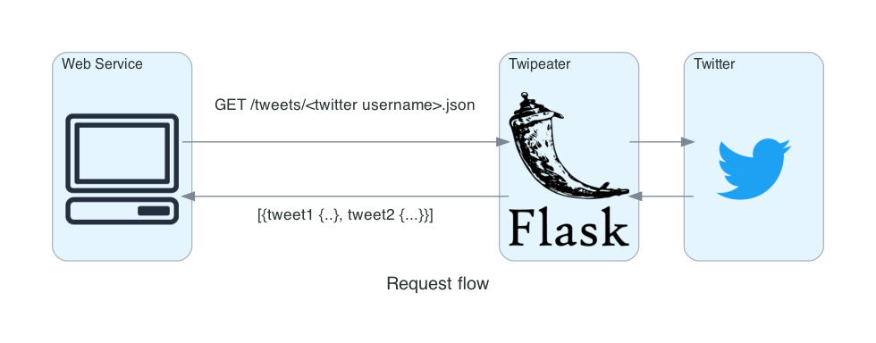

[](https://github.com/maluio/twipeater/actions/workflows/tests.yaml)

# Twipeater

A webservice wrapping [Twint - An advanced Twitter scraping & OSINT tool](https://github.com/twintproject/twint) with an easy-to-use API

## Goals

    * Fetch tweets without having a Twitter API account
    * Provide reponses in different formats

## Supported response formats

    * JSON
    * Atom (RSS)

## Request flow



## Usage

`GET <TWIPEATER>/tweets/<Twitter username>.<format>`

## Examples

### Request json

`GET <TWIPEATER>/tweets/stackoverflow.json`

### Response json

```Json
{
  "tweets": [
    {
      "hashtags": [
        "stackoverflowknows"
      ],
      "id": 1501664241874579456,
      "likes_count": 6,
      "link": "https://twitter.com/StackOverflow/status/1501664241874579456",
      "name": "Stack Overflow",
      "published_at": "Wed, 09 Mar 2022 21:00:29 GMT",
      "replies_count": 0,
      "retweets_count": 1,
      "thumbnail": "",
      "tweet": "\"Rejection should be the default decision for any research that doesn't meet high standards of rigor.\" #stackoverflowknows  https://t.co/dGJNKcbFfs"
    },
    ...
  ]
}
```

### Request atom

`GET <TWIPEATER>/tweets/stackoverflow.atom`

### Response atom

```xml
<?xml version='1.0' encoding='utf8'?>
<feed xmlns="https://www.w3.org/2005/Atom">
    <title>stackoverflow (Twipeater)</title>
    <id>twipeater_tweets_stackoverflow</id>
    <entry>
        <title>"Rejection should be the default decision for any research that doesn't meet high standards of rigor."
            #stackoverflowknows https://t.co/dGJNKcbFfs
        </title>
        <description>"Rejection should be the default decision for any research that doesn't meet high standards of
            rigor." #stackoverflowknows https://t.co/dGJNKcbFfs
        </description>
        <link>https://twitter.com/StackOverflow/status/1501664241874579456</link>
        <published>2022-03-09T22:00:29+01:00</published>
    </entry>
    ...
</feed>
```

## Issue with Twint: "CRITICAL:twint.run:Twint:Feed:noDataExpecting"

This is a known issue with the Twin library.
See [\[ERROR\] CRITICAL:twint.run:Twint:Feed:noDataExpecting ~ Inconsistent results [High Severity] #604 ](https://github.com/twintproject/twint/issues/604)

To solve this issue in the **dev environment** make sure to **not** install twint through the requirements files.
Instead run

`
pip install --upgrade git+https://github.com/twintproject/twint.git@origin/master#egg=twint
`

To solve this issue on prod use the Dockerfile in this repo to install Twin
